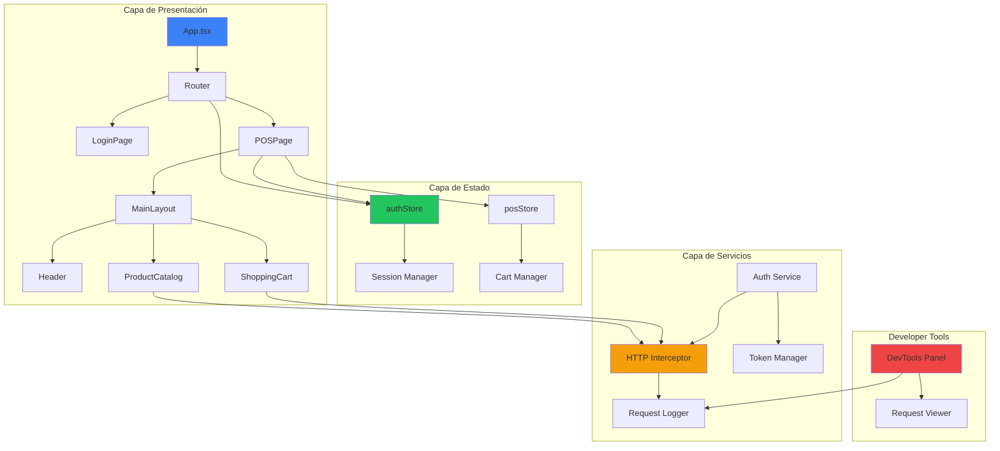
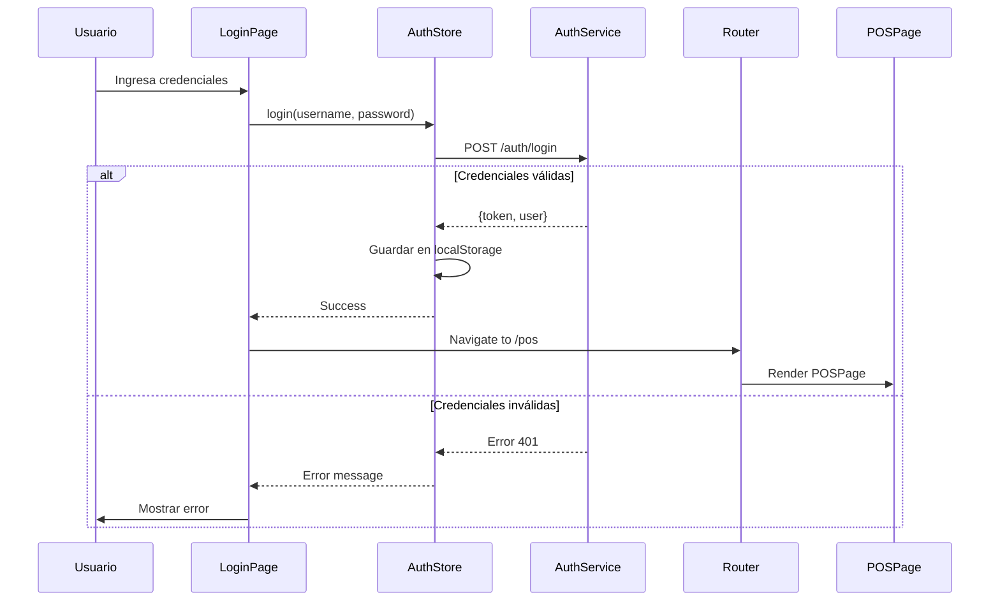
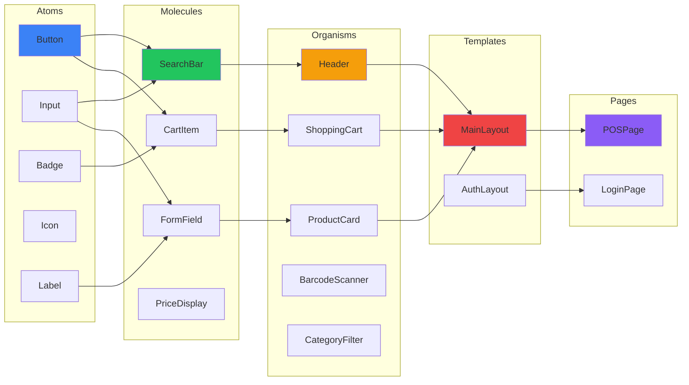
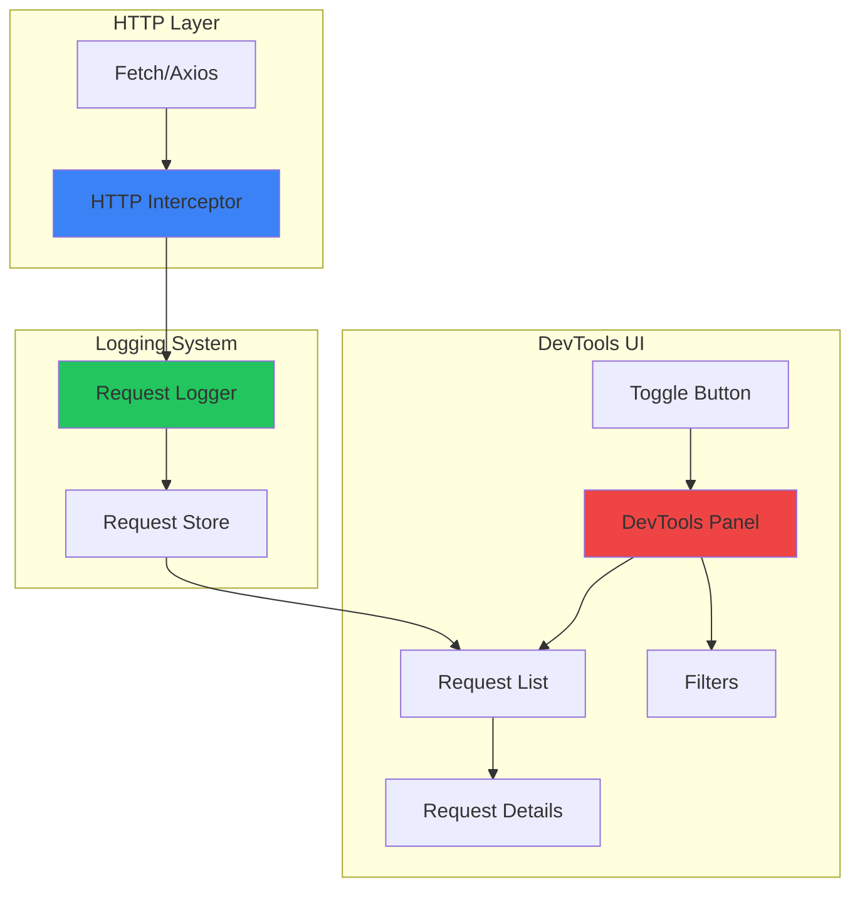

# Documento de Diseño Técnico: Autenticación y Refactorización de Arquitectura POS

## Visión General

Este documento define el diseño técnico para tres mejoras principales del sistema POS frontend:

1. **Sistema de Autenticación**: Implementación completa de login/autenticación con gestión de sesiones y protección de rutas
2. **Refactorización Atomic Design**: Reorganización de la estructura de componentes siguiendo la metodología Atomic Design
3. **Sistema de Developer Tools**: Herramientas de desarrollo para visualizar requests HTTP y facilitar debugging

### Objetivos del Diseño

- Implementar autenticación sin romper la funcionalidad existente del POS
- Reorganizar componentes de forma incremental y segura
- Proporcionar herramientas de debugging que no afecten el rendimiento en producción
- Mantener consistencia visual con la paleta de colores existente
- Seguir patrones establecidos (Zustand para estado, PrimeReact para UI)

### Alcance

**Incluido:**
- Store de autenticación con Zustand
- Componentes de login y protección de rutas
- Reorganización completa de componentes según Atomic Design
- Interceptor HTTP para captura de requests
- Panel de Developer Tools con visualización de requests

**Excluido:**
- Backend de autenticación (se simulará con mock)
- Integración con servicios de autenticación externos (OAuth, SAML)
- Persistencia de logs de requests en servidor
- Análisis avanzado de performance

## Arquitectura

### Diagrama de Arquitectura General



### Diagrama de Flujo de Autenticación



### Diagrama de Estructura Atomic Design



### Diagrama de Developer Tools




## Componentes y Interfaces

### 1. Sistema de Autenticación

#### 1.1 AuthStore (Zustand)

**Ubicación:** `src/store/authStore.ts`

**Interfaz de Estado:**

```typescript
interface User {
  id: string
  username: string
  name: string
  role: 'admin' | 'cashier' | 'supervisor'
  email?: string
}

interface AuthState {
  // Estado
  user: User | null
  token: string | null
  isAuthenticated: boolean
  isLoading: boolean
  error: string | null
  
  // Acciones
  login: (username: string, password: string) => Promise<void>
  logout: () => void
  checkAuth: () => Promise<void>
  clearError: () => void
  
  // Helpers
  getToken: () => string | null
  getUser: () => User | null
  hasRole: (role: string) => boolean
}
```

**Implementación:**

```typescript
import { create } from 'zustand'
import { authService } from '../services/authService'

const TOKEN_KEY = 'pos_auth_token'
const USER_KEY = 'pos_auth_user'

export const useAuthStore = create<AuthState>((set, get) => ({
  user: null,
  token: null,
  isAuthenticated: false,
  isLoading: false,
  error: null,
  
  login: async (username: string, password: string) => {
    set({ isLoading: true, error: null })
    
    try {
      const response = await authService.login(username, password)
      
      // Guardar en localStorage
      localStorage.setItem(TOKEN_KEY, response.token)
      localStorage.setItem(USER_KEY, JSON.stringify(response.user))
      
      set({
        user: response.user,
        token: response.token,
        isAuthenticated: true,
        isLoading: false,
        error: null
      })
    } catch (error) {
      set({
        error: error.message || 'Error de autenticación',
        isLoading: false,
        isAuthenticated: false
      })
      throw error
    }
  },
  
  logout: () => {
    localStorage.removeItem(TOKEN_KEY)
    localStorage.removeItem(USER_KEY)
    
    set({
      user: null,
      token: null,
      isAuthenticated: false,
      error: null
    })
  },
  
  checkAuth: async () => {
    const token = localStorage.getItem(TOKEN_KEY)
    const userStr = localStorage.getItem(USER_KEY)
    
    if (!token || !userStr) {
      set({ isAuthenticated: false })
      return
    }
    
    try {
      const user = JSON.parse(userStr)
      
      // Verificar token con el servidor
      const isValid = await authService.verifyToken(token)
      
      if (isValid) {
        set({
          user,
          token,
          isAuthenticated: true
        })
      } else {
        get().logout()
      }
    } catch (error) {
      get().logout()
    }
  },
  
  clearError: () => set({ error: null }),
  
  getToken: () => get().token,
  getUser: () => get().user,
  hasRole: (role: string) => get().user?.role === role
}))
```

#### 1.2 AuthService

**Ubicación:** `src/services/authService.ts`

**Interfaz:**

```typescript
interface LoginRequest {
  username: string
  password: string
}

interface LoginResponse {
  token: string
  user: User
  expiresIn: number
}

interface AuthService {
  login: (username: string, password: string) => Promise<LoginResponse>
  logout: () => Promise<void>
  verifyToken: (token: string) => Promise<boolean>
  refreshToken: (token: string) => Promise<string>
}
```

**Implementación Mock:**

```typescript
// Mock implementation para desarrollo
export const authService: AuthService = {
  login: async (username: string, password: string): Promise<LoginResponse> => {
    // Simular delay de red
    await new Promise(resolve => setTimeout(resolve, 800))
    
    // Usuarios mock
    const mockUsers = {
      'admin': {
        password: 'admin123',
        user: {
          id: '1',
          username: 'admin',
          name: 'Administrador',
          role: 'admin' as const,
          email: 'admin@pos.com'
        }
      },
      'cajero': {
        password: 'cajero123',
        user: {
          id: '2',
          username: 'cajero',
          name: 'Maria Garcia',
          role: 'cashier' as const,
          email: 'maria@pos.com'
        }
      }
    }
    
    const mockUser = mockUsers[username]
    
    if (!mockUser || mockUser.password !== password) {
      throw new Error('Usuario o contraseña incorrectos')
    }
    
    // Generar token mock (en producción sería JWT del servidor)
    const token = btoa(JSON.stringify({
      userId: mockUser.user.id,
      username: mockUser.user.username,
      exp: Date.now() + 8 * 60 * 60 * 1000 // 8 horas
    }))
    
    return {
      token,
      user: mockUser.user,
      expiresIn: 8 * 60 * 60
    }
  },
  
  logout: async () => {
    await new Promise(resolve => setTimeout(resolve, 200))
  },
  
  verifyToken: async (token: string): Promise<boolean> => {
    try {
      const payload = JSON.parse(atob(token))
      return payload.exp > Date.now()
    } catch {
      return false
    }
  },
  
  refreshToken: async (token: string): Promise<string> => {
    // Mock refresh
    await new Promise(resolve => setTimeout(resolve, 300))
    return token
  }
}
```

#### 1.3 LoginPage Component

**Ubicación:** `src/components/pages/LoginPage.tsx`

**Props:** Ninguna

**Estructura:**

```typescript
import { useState, useRef } from 'react'
import { useNavigate } from 'react-router-dom'
import { InputText } from 'primereact/inputtext'
import { Password } from 'primereact/password'
import { Button } from 'primereact/button'
import { Toast } from 'primereact/toast'
import { useAuthStore } from '../../store/authStore'

export default function LoginPage() {
  const [username, setUsername] = useState('')
  const [password, setPassword] = useState('')
  const { login, isLoading, error, clearError } = useAuthStore()
  const navigate = useNavigate()
  const toast = useRef<Toast>(null)
  
  const handleSubmit = async (e: React.FormEvent) => {
    e.preventDefault()
    clearError()
    
    try {
      await login(username, password)
      toast.current?.show({
        severity: 'success',
        summary: 'Éxito',
        detail: 'Inicio de sesión exitoso',
        life: 2000
      })
      
      setTimeout(() => {
        navigate('/pos')
      }, 500)
    } catch (error) {
      toast.current?.show({
        severity: 'error',
        summary: 'Error',
        detail: error.message || 'Error al iniciar sesión',
        life: 4000
      })
    }
  }
  
  return (
    <div className="login-page" style={{
      minHeight: '100vh',
      display: 'flex',
      alignItems: 'center',
      justifyContent: 'center',
      backgroundColor: 'var(--pos-bg-primary)'
    }}>
      <Toast ref={toast} />
      
      <div className="login-card" style={{
        width: '100%',
        maxWidth: '420px',
        padding: '2rem',
        backgroundColor: 'var(--pos-bg-secondary)',
        borderRadius: '16px',
        border: '1px solid var(--pos-border)',
        boxShadow: '0 8px 32px rgba(0, 0, 0, 0.4)'
      }}>
        {/* Logo y título */}
        <div className="text-center mb-5">
          <div className="inline-flex align-items-center justify-content-center mb-3"
               style={{
                 width: '80px',
                 height: '80px',
                 borderRadius: '20px',
                 background: 'linear-gradient(135deg, var(--pos-accent) 0%, #1d4ed8 100%)'
               }}>
            <i className="pi pi-shopping-cart" style={{ fontSize: '2.5rem', color: 'white' }}></i>
          </div>
          <h1 className="text-3xl font-bold mb-2" style={{ color: 'var(--pos-text-primary)' }}>
            SuperMarket POS
          </h1>
          <p className="text-sm" style={{ color: 'var(--pos-text-secondary)' }}>
            Inicia sesión para continuar
          </p>
        </div>
        
        {/* Formulario */}
        <form onSubmit={handleSubmit}>
          <div className="mb-4">
            <label htmlFor="username" className="block mb-2 text-sm font-medium"
                   style={{ color: 'var(--pos-text-primary)' }}>
              Usuario
            </label>
            <InputText
              id="username"
              value={username}
              onChange={(e) => setUsername(e.target.value)}
              placeholder="Ingresa tu usuario"
              className="w-full"
              disabled={isLoading}
              autoFocus
            />
          </div>
          
          <div className="mb-5">
            <label htmlFor="password" className="block mb-2 text-sm font-medium"
                   style={{ color: 'var(--pos-text-primary)' }}>
              Contraseña
            </label>
            <Password
              id="password"
              value={password}
              onChange={(e) => setPassword(e.target.value)}
              placeholder="Ingresa tu contraseña"
              className="w-full"
              inputClassName="w-full"
              toggleMask
              feedback={false}
              disabled={isLoading}
            />
          </div>
          
          <Button
            type="submit"
            label={isLoading ? 'Iniciando sesión...' : 'Iniciar Sesión'}
            icon={isLoading ? 'pi pi-spin pi-spinner' : 'pi pi-sign-in'}
            className="w-full"
            style={{
              backgroundColor: 'var(--pos-accent)',
              border: 'none',
              padding: '0.75rem'
            }}
            disabled={isLoading || !username || !password}
          />
        </form>
        
        {/* Información de usuarios demo */}
        <div className="mt-5 p-3" style={{
          backgroundColor: 'var(--pos-bg-tertiary)',
          borderRadius: '8px',
          border: '1px solid var(--pos-border)'
        }}>
          <p className="text-xs font-semibold mb-2" style={{ color: 'var(--pos-text-secondary)' }}>
            Usuarios de prueba:
          </p>
          <p className="text-xs mb-1" style={{ color: 'var(--pos-text-secondary)' }}>
            <strong>Admin:</strong> admin / admin123
          </p>
          <p className="text-xs" style={{ color: 'var(--pos-text-secondary)' }}>
            <strong>Cajero:</strong> cajero / cajero123
          </p>
        </div>
      </div>
    </div>
  )
}
```

#### 1.4 ProtectedRoute Component

**Ubicación:** `src/components/auth/ProtectedRoute.tsx`

```typescript
import { Navigate, Outlet } from 'react-router-dom'
import { useAuthStore } from '../../store/authStore'
import { useEffect } from 'react'

interface ProtectedRouteProps {
  requiredRole?: string
  redirectTo?: string
}

export default function ProtectedRoute({ 
  requiredRole, 
  redirectTo = '/login' 
}: ProtectedRouteProps) {
  const { isAuthenticated, checkAuth, user } = useAuthStore()
  
  useEffect(() => {
    checkAuth()
  }, [checkAuth])
  
  if (!isAuthenticated) {
    return <Navigate to={redirectTo} replace />
  }
  
  if (requiredRole && user?.role !== requiredRole) {
    return <Navigate to="/unauthorized" replace />
  }
  
  return <Outlet />
}
```

### 2. Estructura Atomic Design

#### 2.1 Atoms

**Ubicación:** `src/components/atoms/`

**Componentes:**

1. **Button** (`atoms/Button.tsx`)
   - Wrapper de PrimeReact Button con estilos consistentes
   - Props: variant (primary, secondary, danger), size, icon, loading

2. **Input** (`atoms/Input.tsx`)
   - Wrapper de PrimeReact InputText
   - Props: type, placeholder, error, disabled

3. **Badge** (`atoms/Badge.tsx`)
   - Wrapper de PrimeReact Badge
   - Props: value, severity, size

4. **Icon** (`atoms/Icon.tsx`)
   - Wrapper de PrimeIcons
   - Props: name, size, color, spin

5. **Label** (`atoms/Label.tsx`)
   - Label estilizado consistente
   - Props: text, required, htmlFor

#### 2.2 Molecules

**Ubicación:** `src/components/molecules/`

**Componentes:**

1. **SearchBar** (`molecules/SearchBar.tsx`)
   ```typescript
   interface SearchBarProps {
     value: string
     onChange: (value: string) => void
     placeholder?: string
     onSearch?: () => void
   }
   ```

2. **FormField** (`molecules/FormField.tsx`)
   ```typescript
   interface FormFieldProps {
     label: string
     error?: string
     required?: boolean
     children: React.ReactNode
   }
   ```

3. **CartItem** (`molecules/cart/CartItem.tsx`)
   - Mover desde `components/cart/CartItem.tsx`
   - Mantener toda la funcionalidad existente

4. **PriceDisplay** (`molecules/PriceDisplay.tsx`)
   ```typescript
   interface PriceDisplayProps {
     amount: number
     label?: string
     size?: 'small' | 'medium' | 'large'
     highlight?: boolean
   }
   ```

#### 2.3 Organisms

**Ubicación:** `src/components/organisms/`

**Componentes:**

1. **Header** (`organisms/Header.tsx`)
   - Mover desde `components/layout/Header.tsx`
   - Agregar botón de logout
   - Mostrar usuario autenticado

2. **ProductCard** (`organisms/products/ProductCard.tsx`)
   - Mover desde `components/products/ProductCard.tsx`

3. **ShoppingCart** (`organisms/cart/ShoppingCart.tsx`)
   - Mover desde `components/cart/ShoppingCart.tsx`

4. **BarcodeScanner** (`organisms/products/BarcodeScanner.tsx`)
   - Mover desde `components/products/BarcodeScanner.tsx`

5. **CategoryFilter** (`organisms/products/CategoryFilter.tsx`)
   - Mover desde `components/products/CategoryFilter.tsx`

6. **ProductCatalog** (`organisms/products/ProductCatalog.tsx`)
   - Mover desde `components/products/ProductCatalog.tsx`

#### 2.4 Templates

**Ubicación:** `src/components/templates/`

**Componentes:**

1. **MainLayout** (`templates/MainLayout.tsx`)
   ```typescript
   interface MainLayoutProps {
     children: React.ReactNode
   }
   
   export default function MainLayout({ children }: MainLayoutProps) {
     return (
       <div className="flex flex-column h-full" 
            style={{ backgroundColor: 'var(--pos-bg-primary)' }}>
         <Header />
         <main className="flex-1 overflow-hidden">
           {children}
         </main>
       </div>
     )
   }
   ```

2. **AuthLayout** (`templates/AuthLayout.tsx`)
   ```typescript
   interface AuthLayoutProps {
     children: React.ReactNode
   }
   
   export default function AuthLayout({ children }: AuthLayoutProps) {
     return (
       <div className="auth-layout" style={{
         minHeight: '100vh',
         display: 'flex',
         alignItems: 'center',
         justifyContent: 'center',
         backgroundColor: 'var(--pos-bg-primary)'
       }}>
         {children}
       </div>
     )
   }
   ```

#### 2.5 Pages

**Ubicación:** `src/components/pages/`

**Componentes:**

1. **POSPage** (`pages/POSPage.tsx`)
   ```typescript
   export default function POSPage() {
     const toast = useRef<Toast>(null)
     const { currentReceipt, setCurrentReceipt, isCheckoutOpen } = usePOSStore()
     
     return (
       <MainLayout>
         <Toast ref={toast} position="top-right" />
         
         <div className="pos-main-layout flex flex-1 overflow-hidden gap-3 p-3">
           <section className="pos-catalog-panel flex-1 overflow-hidden">
             <ProductCatalog toast={toast} />
           </section>
           
           <aside className="pos-cart-panel">
             <ShoppingCart />
           </aside>
         </div>
         
         {isCheckoutOpen && (
           <Suspense fallback={null}>
             <CheckoutDialog />
           </Suspense>
         )}
         
         {currentReceipt && (
           <Suspense fallback={null}>
             <ReceiptDialog
               visible={currentReceipt !== null}
               transaction={currentReceipt}
               onClose={() => setCurrentReceipt(null)}
             />
           </Suspense>
         )}
       </MainLayout>
     )
   }
   ```

2. **LoginPage** (`pages/LoginPage.tsx`)
   - Ya definido en sección 1.3

### 3. Sistema de Developer Tools

#### 3.1 Request Logger

**Ubicación:** `src/services/requestLogger.ts`

**Interfaz:**

```typescript
interface RequestLog {
  id: string
  timestamp: number
  method: string
  url: string
  requestHeaders: Record<string, string>
  requestBody?: any
  responseStatus?: number
  responseHeaders?: Record<string, string>
  responseBody?: any
  duration?: number
  error?: Error
}

interface RequestLogger {
  logs: RequestLog[]
  addLog: (log: RequestLog) => void
  clearLogs: () => void
  getFilteredLogs: (filters: LogFilters) => RequestLog[]
  subscribe: (callback: (logs: RequestLog[]) => void) => () => void
}

interface LogFilters {
  method?: string
  status?: number
  search?: string
}
```

**Implementación:**

```typescript
class RequestLoggerService {
  private logs: RequestLog[] = []
  private maxLogs = 100
  private subscribers: Set<(logs: RequestLog[]) => void> = new Set()
  
  addLog(log: RequestLog) {
    this.logs = [log, ...this.logs].slice(0, this.maxLogs)
    this.notifySubscribers()
  }
  
  clearLogs() {
    this.logs = []
    this.notifySubscribers()
  }
  
  getLogs(): RequestLog[] {
    return this.logs
  }
  
  getFilteredLogs(filters: LogFilters): RequestLog[] {
    return this.logs.filter(log => {
      if (filters.method && log.method !== filters.method) return false
      if (filters.status && log.responseStatus !== filters.status) return false
      if (filters.search && !log.url.includes(filters.search)) return false
      return true
    })
  }
  
  subscribe(callback: (logs: RequestLog[]) => void) {
    this.subscribers.add(callback)
    return () => this.subscribers.delete(callback)
  }
  
  private notifySubscribers() {
    this.subscribers.forEach(callback => callback(this.logs))
  }
}

export const requestLogger = new RequestLoggerService()
```

#### 3.2 HTTP Interceptor

**Ubicación:** `src/services/httpInterceptor.ts`

```typescript
import { requestLogger } from './requestLogger'
import { v4 as uuidv4 } from 'uuid'

// Interceptar fetch global
const originalFetch = window.fetch

window.fetch = async function(...args) {
  const [url, options = {}] = args
  const logId = uuidv4()
  const startTime = Date.now()
  
  const log: RequestLog = {
    id: logId,
    timestamp: startTime,
    method: options.method || 'GET',
    url: url.toString(),
    requestHeaders: options.headers as Record<string, string> || {},
    requestBody: options.body ? JSON.parse(options.body as string) : undefined
  }
  
  try {
    const response = await originalFetch.apply(this, args)
    const endTime = Date.now()
    
    // Clonar response para poder leerla
    const clonedResponse = response.clone()
    const responseBody = await clonedResponse.json().catch(() => null)
    
    log.responseStatus = response.status
    log.responseHeaders = Object.fromEntries(response.headers.entries())
    log.responseBody = responseBody
    log.duration = endTime - startTime
    
    requestLogger.addLog(log)
    
    return response
  } catch (error) {
    const endTime = Date.now()
    
    log.error = error as Error
    log.duration = endTime - startTime
    
    requestLogger.addLog(log)
    
    throw error
  }
}

// Inicializar interceptor solo en desarrollo
export function initializeHttpInterceptor() {
  if (import.meta.env.DEV) {
    console.log('[DevTools] HTTP Interceptor initialized')
  }
}
```

#### 3.3 DevTools Panel Component

**Ubicación:** `src/components/devtools/DevToolsPanel.tsx`

```typescript
import { useState, useEffect } from 'react'
import { Sidebar } from 'primereact/sidebar'
import { Button } from 'primereact/button'
import { DataTable } from 'primereact/datatable'
import { Column } from 'primereact/column'
import { Dropdown } from 'primereact/dropdown'
import { InputText } from 'primereact/inputtext'
import { requestLogger } from '../../services/requestLogger'
import { RequestLog } from '../../services/requestLogger'

export default function DevToolsPanel() {
  const [visible, setVisible] = useState(false)
  const [logs, setLogs] = useState<RequestLog[]>([])
  const [selectedLog, setSelectedLog] = useState<RequestLog | null>(null)
  const [methodFilter, setMethodFilter] = useState<string>('')
  const [searchFilter, setSearchFilter] = useState<string>('')
  
  useEffect(() => {
    const unsubscribe = requestLogger.subscribe((newLogs) => {
      setLogs(newLogs)
    })
    
    return unsubscribe
  }, [])
  
  const filteredLogs = requestLogger.getFilteredLogs({
    method: methodFilter || undefined,
    search: searchFilter || undefined
  })
  
  const methodBodyTemplate = (rowData: RequestLog) => {
    const colors = {
      GET: '#3b82f6',
      POST: '#22c55e',
      PUT: '#f59e0b',
      DELETE: '#ef4444',
      PATCH: '#8b5cf6'
    }
    
    return (
      <span style={{
        padding: '0.25rem 0.5rem',
        borderRadius: '4px',
        backgroundColor: colors[rowData.method] || '#6b7280',
        color: 'white',
        fontSize: '0.75rem',
        fontWeight: 'bold'
      }}>
        {rowData.method}
      </span>
    )
  }
  
  const statusBodyTemplate = (rowData: RequestLog) => {
    const status = rowData.responseStatus
    let color = '#6b7280'
    
    if (status) {
      if (status >= 200 && status < 300) color = '#22c55e'
      else if (status >= 400 && status < 500) color = '#f59e0b'
      else if (status >= 500) color = '#ef4444'
    }
    
    return (
      <span style={{
        padding: '0.25rem 0.5rem',
        borderRadius: '4px',
        backgroundColor: color,
        color: 'white',
        fontSize: '0.75rem',
        fontWeight: 'bold'
      }}>
        {status || 'Pending'}
      </span>
    )
  }
  
  const durationBodyTemplate = (rowData: RequestLog) => {
    return rowData.duration ? `${rowData.duration}ms` : '-'
  }
  
  return (
    <>
      {/* Toggle Button */}
      {import.meta.env.DEV && (
        <Button
          icon="pi pi-code"
          className="p-button-rounded p-button-warning"
          style={{
            position: 'fixed',
            bottom: '20px',
            right: '20px',
            zIndex: 9999,
            width: '56px',
            height: '56px',
            boxShadow: '0 4px 12px rgba(0, 0, 0, 0.3)'
          }}
          onClick={() => setVisible(true)}
          tooltip="Developer Tools"
          tooltipOptions={{ position: 'left' }}
        />
      )}
      
      {/* Sidebar Panel */}
      <Sidebar
        visible={visible}
        onHide={() => setVisible(false)}
        position="right"
        style={{ width: '800px', backgroundColor: 'var(--pos-bg-secondary)' }}
        header={
          <div className="flex align-items-center justify-content-between">
            <h3 style={{ color: 'var(--pos-text-primary)', margin: 0 }}>
              Developer Tools
            </h3>
            <Button
              icon="pi pi-trash"
              className="p-button-sm p-button-danger p-button-text"
              onClick={() => requestLogger.clearLogs()}
              tooltip="Clear logs"
            />
          </div>
        }
      >
        {/* Filters */}
        <div className="flex gap-2 mb-3">
          <Dropdown
            value={methodFilter}
            options={[
              { label: 'All Methods', value: '' },
              { label: 'GET', value: 'GET' },
              { label: 'POST', value: 'POST' },
              { label: 'PUT', value: 'PUT' },
              { label: 'DELETE', value: 'DELETE' }
            ]}
            onChange={(e) => setMethodFilter(e.value)}
            placeholder="Filter by method"
            className="flex-1"
          />
          
          <InputText
            value={searchFilter}
            onChange={(e) => setSearchFilter(e.target.value)}
            placeholder="Search URL..."
            className="flex-1"
          />
        </div>
        
        {/* Request List */}
        <DataTable
          value={filteredLogs}
          selectionMode="single"
          selection={selectedLog}
          onSelectionChange={(e) => setSelectedLog(e.value)}
          scrollable
          scrollHeight="400px"
          style={{ marginBottom: '1rem' }}
        >
          <Column field="method" header="Method" body={methodBodyTemplate} style={{ width: '100px' }} />
          <Column field="url" header="URL" style={{ width: '300px' }} />
          <Column field="responseStatus" header="Status" body={statusBodyTemplate} style={{ width: '100px' }} />
          <Column field="duration" header="Time" body={durationBodyTemplate} style={{ width: '100px' }} />
        </DataTable>
        
        {/* Request Details */}
        {selectedLog && (
          <div style={{
            backgroundColor: 'var(--pos-bg-tertiary)',
            borderRadius: '8px',
            padding: '1rem',
            border: '1px solid var(--pos-border)'
          }}>
            <h4 style={{ color: 'var(--pos-text-primary)', marginTop: 0 }}>
              Request Details
            </h4>
            
            <div className="mb-3">
              <strong style={{ color: 'var(--pos-text-secondary)' }}>URL:</strong>
              <p style={{ color: 'var(--pos-text-primary)', wordBreak: 'break-all' }}>
                {selectedLog.url}
              </p>
            </div>
            
            {selectedLog.requestBody && (
              <div className="mb-3">
                <strong style={{ color: 'var(--pos-text-secondary)' }}>Request Body:</strong>
                <pre style={{
                  backgroundColor: 'var(--pos-bg-primary)',
                  padding: '0.75rem',
                  borderRadius: '4px',
                  overflow: 'auto',
                  color: 'var(--pos-text-primary)',
                  fontSize: '0.875rem'
                }}>
                  {JSON.stringify(selectedLog.requestBody, null, 2)}
                </pre>
              </div>
            )}
            
            {selectedLog.responseBody && (
              <div className="mb-3">
                <strong style={{ color: 'var(--pos-text-secondary)' }}>Response Body:</strong>
                <pre style={{
                  backgroundColor: 'var(--pos-bg-primary)',
                  padding: '0.75rem',
                  borderRadius: '4px',
                  overflow: 'auto',
                  color: 'var(--pos-text-primary)',
                  fontSize: '0.875rem'
                }}>
                  {JSON.stringify(selectedLog.responseBody, null, 2)}
                </pre>
              </div>
            )}
            
            {selectedLog.error && (
              <div className="mb-3">
                <strong style={{ color: 'var(--pos-danger)' }}>Error:</strong>
                <p style={{ color: 'var(--pos-danger)' }}>
                  {selectedLog.error.message}
                </p>
              </div>
            )}
          </div>
        )}
      </Sidebar>
    </>
  )
}
```


## Estructura de Archivos Final

```
src/
├── components/
│   ├── atoms/
│   │   ├── Button.tsx
│   │   ├── Input.tsx
│   │   ├── Badge.tsx
│   │   ├── Icon.tsx
│   │   └── Label.tsx
│   ├── molecules/
│   │   ├── SearchBar.tsx
│   │   ├── FormField.tsx
│   │   ├── PriceDisplay.tsx
│   │   └── cart/
│   │       ├── CartItem.tsx          ← movido desde components/cart/
│   │       └── DiscountInput.tsx     ← movido desde components/cart/
│   ├── organisms/
│   │   ├── Header.tsx                ← movido desde components/layout/
│   │   ├── cart/
│   │   │   ├── ShoppingCart.tsx      ← movido desde components/cart/
│   │   │   └── CartSummary.tsx       ← movido desde components/cart/
│   │   ├── products/
│   │   │   ├── ProductCard.tsx       ← movido desde components/products/
│   │   │   ├── ProductGrid.tsx       ← movido desde components/products/
│   │   │   ├── ProductCatalog.tsx    ← movido desde components/products/
│   │   │   ├── BarcodeScanner.tsx    ← movido desde components/products/
│   │   │   └── CategoryFilter.tsx    ← movido desde components/products/
│   │   └── checkout/
│   │       ├── CheckoutDialog.tsx    ← movido desde components/checkout/
│   │       └── ReceiptDialog.tsx     ← movido desde components/receipt/
│   ├── templates/
│   │   ├── MainLayout.tsx            ← nuevo
│   │   └── AuthLayout.tsx            ← nuevo
│   ├── pages/
│   │   ├── POSPage.tsx               ← nuevo (extrae lógica de App.tsx)
│   │   └── LoginPage.tsx             ← nuevo
│   ├── auth/
│   │   └── ProtectedRoute.tsx        ← nuevo
│   └── devtools/
│       └── DevToolsPanel.tsx         ← nuevo
├── store/
│   ├── posStore.ts                   ← sin cambios
│   └── authStore.ts                  ← nuevo
├── services/
│   ├── authService.ts                ← nuevo
│   ├── requestLogger.ts              ← nuevo
│   └── httpInterceptor.ts            ← nuevo
├── types/
│   └── index.ts                      ← agregar tipos de Auth
└── App.tsx                           ← refactorizado con Router
```

## Actualización de App.tsx

Con React Router y autenticación integrados:

```typescript
import { BrowserRouter, Routes, Route, Navigate } from 'react-router-dom'
import { useEffect } from 'react'
import { useAuthStore } from './store/authStore'
import { initializeHttpInterceptor } from './services/httpInterceptor'
import ProtectedRoute from './components/auth/ProtectedRoute'
import LoginPage from './components/pages/LoginPage'
import POSPage from './components/pages/POSPage'

// Inicializar interceptor HTTP en modo desarrollo
if (import.meta.env.DEV) {
  initializeHttpInterceptor()
}

function App() {
  const { checkAuth } = useAuthStore()

  useEffect(() => {
    checkAuth()
  }, [checkAuth])

  return (
    <BrowserRouter>
      <Routes>
        {/* Ruta pública */}
        <Route path="/login" element={<LoginPage />} />

        {/* Rutas protegidas */}
        <Route element={<ProtectedRoute />}>
          <Route path="/pos" element={<POSPage />} />
          <Route path="/" element={<Navigate to="/pos" replace />} />
        </Route>

        {/* Fallback */}
        <Route path="*" element={<Navigate to="/" replace />} />
      </Routes>
    </BrowserRouter>
  )
}

export default App
```

## Nuevos Tipos en src/types/index.ts

```typescript
// Agregar al archivo existente de tipos

export interface User {
  id: string
  username: string
  name: string
  role: 'admin' | 'cashier' | 'supervisor'
  email?: string
}

export interface AuthState {
  user: User | null
  token: string | null
  isAuthenticated: boolean
  isLoading: boolean
  error: string | null
}

export interface RequestLog {
  id: string
  timestamp: number
  method: string
  url: string
  requestHeaders: Record<string, string>
  requestBody?: unknown
  responseStatus?: number
  responseHeaders?: Record<string, string>
  responseBody?: unknown
  duration?: number
  error?: Error
}

export interface LogFilters {
  method?: string
  status?: number
  search?: string
}
```

## Estrategia de Migración Atomic Design

La migración se realizará en fases para evitar romper la funcionalidad existente:

### Fase 1: Crear estructura de carpetas y atoms
- Crear carpetas: `atoms/`, `molecules/`, `organisms/`, `templates/`, `pages/`
- Crear atoms nuevos (Button, Input, Badge, Icon, Label) como wrappers de PrimeReact
- No mover nada todavía — solo crear nuevos archivos

### Fase 2: Crear molecules
- Crear `SearchBar`, `FormField`, `PriceDisplay` como nuevos componentes
- Mover `CartItem` y `DiscountInput` a `molecules/cart/`
- Actualizar imports en `ShoppingCart.tsx`

### Fase 3: Mover organisms
- Mover `Header` → `organisms/Header.tsx`
- Mover `ProductCard`, `ProductGrid`, `BarcodeScanner`, `CategoryFilter`, `ProductCatalog` → `organisms/products/`
- Mover `ShoppingCart`, `CartSummary` → `organisms/cart/`
- Mover `CheckoutDialog` → `organisms/checkout/`
- Mover `ReceiptDialog` → `organisms/checkout/`
- Actualizar todos los imports en `App.tsx`

### Fase 4: Crear templates y pages
- Crear `MainLayout` y `AuthLayout` en `templates/`
- Crear `POSPage` extrayendo lógica de `App.tsx`
- Crear `LoginPage` con diseño consistente al POS

### Fase 5: Integrar autenticación
- Crear `authStore.ts` y `authService.ts`
- Crear `ProtectedRoute` component
- Instalar `react-router-dom`
- Refactorizar `App.tsx` con Router y rutas protegidas

### Fase 6: Developer Tools
- Crear `requestLogger.ts` y `httpInterceptor.ts`
- Crear `DevToolsPanel.tsx`
- Integrar en `App.tsx` o `main.tsx`

## Propiedades de Corrección (Property-Based Testing)

### Propiedad 1: Autenticación Determinista
```
∀ credenciales válidas → login() siempre retorna token válido
∀ credenciales inválidas → login() siempre lanza error
```

### Propiedad 2: Sesión Persistente
```
∀ token válido en localStorage → checkAuth() restaura sesión
∀ token expirado en localStorage → checkAuth() limpia sesión y redirige
```

### Propiedad 3: Protección de Rutas
```
∀ ruta protegida + usuario no autenticado → redirect a /login
∀ ruta protegida + usuario autenticado → acceso permitido
∀ /login + usuario autenticado → redirect a /pos
```

### Propiedad 4: Captura de Requests
```
∀ fetch() llamado → RequestLogger.logs.length aumenta en 1
∀ request capturado → tiene id, timestamp, method, url
∀ response recibida → log tiene responseStatus y duration
```

### Propiedad 5: Integridad de Migración Atomic Design
```
∀ componente movido → funcionalidad idéntica antes y después
∀ import actualizado → no hay referencias rotas
∀ test existente → sigue pasando después de migración
```

## Dependencias Nuevas Requeridas

```json
{
  "dependencies": {
    "react-router-dom": "^6.28.0"
  }
}
```

> **Nota:** No se requiere `axios` ni `jwt-decode`. Se usará el `fetch` nativo con interceptor global y tokens mock en base64.

## Plan de Testing

### Tests Unitarios

| Componente | Test | Tipo |
|---|---|---|
| `authStore` | login con credenciales válidas | Unit |
| `authStore` | login con credenciales inválidas | Unit |
| `authStore` | logout limpia localStorage | Unit |
| `authStore` | checkAuth restaura sesión válida | Unit |
| `authService` | mock retorna token correcto | Unit |
| `requestLogger` | addLog incrementa logs | Unit |
| `requestLogger` | clearLogs vacía array | Unit |
| `requestLogger` | getFilteredLogs filtra por método | Unit |
| `httpInterceptor` | captura fetch exitoso | Unit |
| `httpInterceptor` | captura fetch con error | Unit |

### Tests de Integración

| Flujo | Test |
|---|---|
| Login → POS | Usuario se autentica y llega al POS |
| Logout → Login | Usuario cierra sesión y vuelve al login |
| Ruta protegida sin auth | Redirige a /login |
| Reload con sesión activa | Restaura sesión correctamente |
| DevTools captura request | Request aparece en panel |

### Tests de Regresión (Atomic Design)

Después de cada fase de migración, ejecutar:
```bash
npm run test        # Todos los tests existentes deben pasar
npm run typecheck   # Sin errores de TypeScript
npm run lint        # Sin errores de ESLint
```
